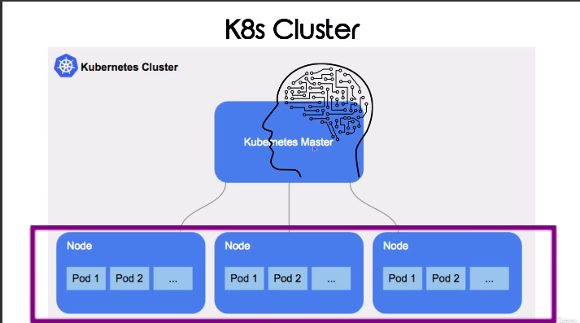
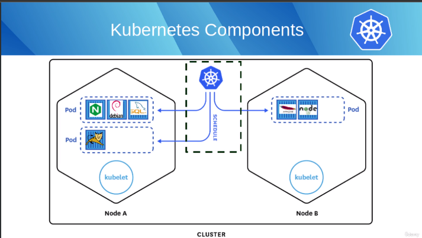
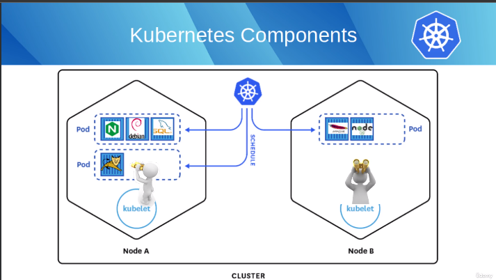
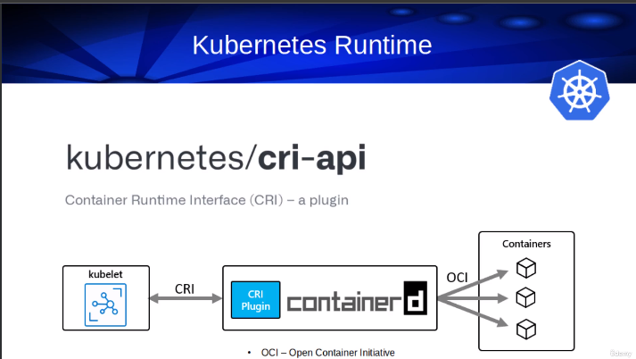
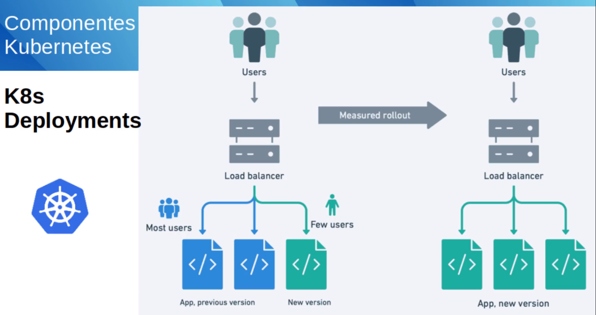
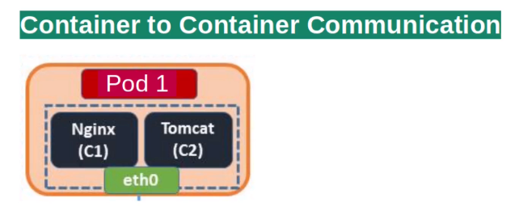
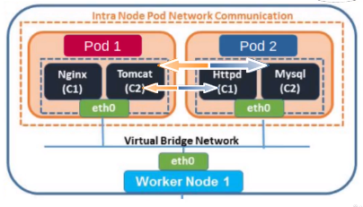
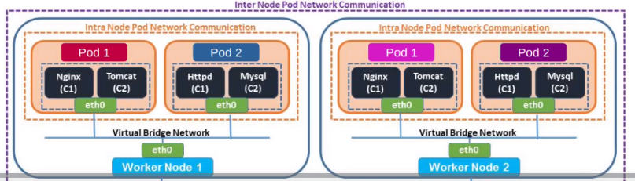
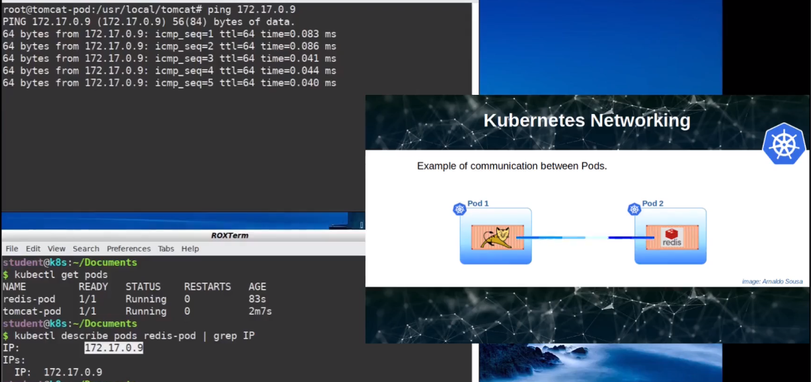
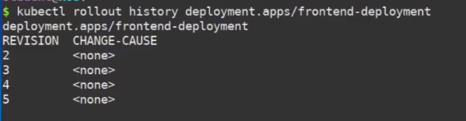

# Kubernetes

Estudo completo de Kubernetes(K8s)

# Cluster

o Cluster é formado por um "Nó Master" e tendo vários outros "Node", cada "Node" pode ser um computador e o "Nó Master" o computador Master. Dentro de cada Node, possui N Pods. O Computador Master (Nó Master) controla o que os outros Node irá processar.
Um Node pode ter por exemplo 3 aplicações:

1. Frontend
2. Backend
3. Db

No qual, essas 3 aplicações fique em um unico Pod e neste mesmo Pod divida 3 container, 1 para o Front, outro para Back e para o Db.
O Pod não executa a aplicação ele contem os container para que possa fazer a orquestração.

    

Trabalhamos com arquivos YAML ou JSON.

# Kube Scheduler

Ele observa os Pods recem criados em nenhum Node atribuido, ai ele seleciona um Node para executa-lo.
Ele leva em consideração para tomar a decisão baseado nos recursos individuais, coletivos, permissoes, locatidade, recursos de hardware e software, se um Node estiver sobrecarregado o Scheduler ele tende a colocar em um outro Node.

    

# Kubelet

Ele executa em cada Node, ele tem um Agente chamado Kubelet, ele é como se fosse um fiscal verificando se um container esta sendo executando dentro de um Pod, pois nenhum container pode executar fora de um Pod. Ele só gerenciar container criados pelo Kubernetes.

    

# Container Runtime Interface (CRI)

Ele é uma interface de plug-in que habilita o KUBELET ao usar uma variedade de container Runtime.
Lembrando que o Kubernetes não executa nenhum container.

O Kubelet entra em contato com o Runtime e o Runtime executa os containers, sempre precisa de um Runtime.

    

# Minikube

Para realizar os testes precisara ter instalado o minikube e que ele esteja rodando.

Minikube => O Minikube é uma implementação leve do Kubernetes que cria uma VM em sua máquina local e implanta um cluster simples contendo apenas um nó.

Comando para execução: minikube start

# ReplicaSet

Controla o aumento e reduz as quanitdades de PODs.

# Deployments

Como default, ele observa qual POD está com menos usuarios utilizando, então ele faz o deployment nele primeiro o derrubando e instalando a nova versão, ve se está tudo bem e depois disto vai passando em todas as outras. Se houve um problema na 1 atualização ele pararia nesta com o erro e nao executaria para o proximo POD.

    

Quando terminado de executar de um `kubectl get deployments`que vc conseguirá ver os deployments.
O Deployments gera automaticamente um ReplicaSet e PODs criando a partir do numero de replicas no arquivo YML.

# Kubernetes Network

1. Container to Container Communication:

Isso é quando um POD tem 2 container rodando dentro dele, eles compartilham o mesmo host networks, ou seja, cada POD tera seu endereço IP e os container compartilham o mesmo endereço IP (ambos possuem o mesmo endereço IP) mas utilizam PORTAS diferentes para se comunicarem (isso no mesmo POD).

    

2. Pod to Pod Communication:

2.1) Comunicação entre PODs rodando em um unico single Node, chamado `INTRA-node Pod Network`. Todos os endereços do IP dos PODs serão diferentes e atribuidos graças a minha rede local compartilhando o mesmo HOST. A comunicação entre esses 2 PODs acontece dentro do mesmo Worker Node, ele virtualiza uma rede dentro do Worker Node que serve para realizar a comunicação desses 2 Pods. Fazendo com que o `Container(C2) do POD 1` se comunique com o `Container(C1) do POD 2.`

    

2.2) Comunicação entre pods rodando em Worker Node diferentes, chamado `INTER-node Pod Network`. Um exp seria o `Worker Node 1` está localizado em minha maquina e o `Worker Node 2` estando na nuvem, no AWS, por exemplo. A comunicação acontece graças ao plugin do kubernetes (K8s) que ira criar as tabelas de rotas para que um container em um Pod em `Worker Node 1` se comunique com um Container em um Pod do `Worder Node 2`.

    

Exemplo dos dois PODs em execução entre tomcat e redis

    

# Comandos

1. CRIAÇÃO de um Pod atraves de um arquivo => kubectl (create ou apply) -f {ARQUIVO.yml}

2. DELETAR um pod => kubectl delete pods {ARQUIVO.yml}

3. VISUALIZAR pods => kubectl get pods

4. VISUALIZAR replicaset => kubectl get replicasets

5. VISUALIZAR deployment => kubectl get deployments

6. ROLLOUT deployment => kubectl rollout status deployment.apps/frontend-deployment

7. Para DESCRIÇÃO MAIS DETALHADA do Deployment => kubectl describe deployment.apps/frontend-deployment

8. Historio do seu deployment => kubectl rollout history deployment.apps/frontend-deployment

Obs: itens 6,7 e 8 o `deployment.apps/frontend-deployment` é o nome do deployment pego pelo comando `kubectl get deployments`
Para visualizar a revisão das mudanças mude a imagem utilizada, para que gere uma nova versão e ai mudando ficara igual na imagem:

    

Para observer a mudança de uma versão especifica, execute o comando:

kubectl rollout history deployment.apps/frontend-deployment --revision=2

9. Realização de ROLLBACK => kubectl rollout undo deployment.apps/frontend-deployment

Caso executado conforme a imagem listada no topico 8. O Kubernets iria criar uma nova VERSÃO com o numero 6 mas se referindo as descrições e implementações da VERSÃO 4

Caos queira uma VERSÃO especifica => kubectl rollout undo deployment.apps/frontend-deployment --to-revision=2

10. Ainda temos o rollout PAUSE e RESUME => kubectl rollout {pause/resume} deployment.apps/frontend-deployment
